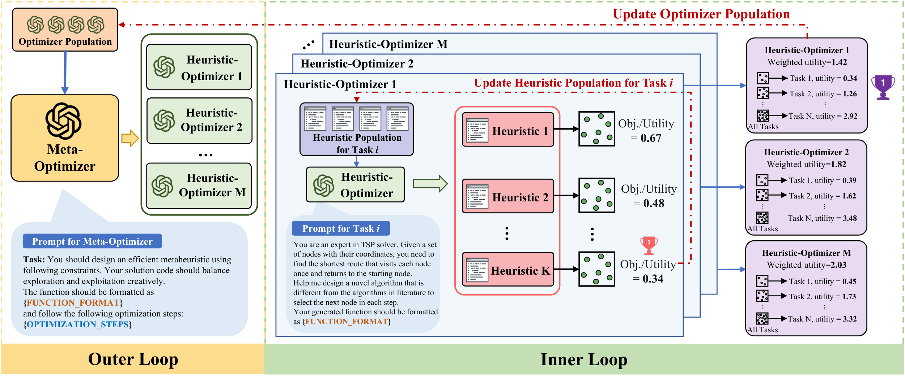

<h1 align="center"> [ICLR 2026] Generalizable Heuristic Generation Through LLMs with Meta-Optimization </h1>

<p align="center">
<a href="https://iclr.cc/virtual/2026/poster/10006991"></a>&nbsp;&nbsp;&nbsp;&nbsp;
<a href="https://arxiv.org/pdf/2505.20881"></a>&nbsp;&nbsp;&nbsp;&nbsp;
<a href="https://github.com/yiding-s/MoH"></a>&nbsp;&nbsp;&nbsp;&nbsp;
<a href="https://github.com/yiding-s/MoH/blob/main/LICENSE"></a>
</p>

This repository contains the official implementation of **MoH (Meta-optimization of Heuristics)**, a novel framework for generating heuristics through Large Language Models with meta-optimization techniques.

## Overview
<p align="center">
  
</p>

---

## Installation

```bash
# Clone the repository
git clone https://github.com/yiding-s/MoH.git
cd MoH

# Install with uv (recommended)
uv sync

# Or install with pip
pip install -e .
```

**Dependencies**: `numpy`, `tqdm`, `hydra-core`, `omegaconf`, `openai`, `numba`, `func-timeout` (see `pyproject.toml` for full list). Require Python >= 3.10.

**Datas**: You can download them from [GoogleDrive](https://drive.google.com/file/d/1e4T8Yiz-qvHcChys2Tk841pbXumGVYu2/view?usp=sharing) and put data folder of each problem under `problems/<problem_name>`, the scripts to generate the data will also be updated in this repository soon.
## Configuration

MoH uses [Hydra](https://hydra.cc/) for configuration management. All config files are located in the `cfg/` directory:

```
cfg/
├── config.yaml              # Main config (iterations, population size, eval_calls_limit, etc.)
├── llm_client/
│   ├── openai.yaml           # OpenAI API config (e.g., gpt-4o)
│   └── ...           # more LLM configurations
├── problem/
│   └── tsp_gls.yaml          # Problem-specific config (TSP-GLS)
└── hydra/output/
    └── local.yaml            # Output directory config
```

**Note: More problems and LLM support coming soon! Since this project has been refactored from the original version, feel free to raise an issue if encounter any unexpected issues. **

### LLM Client Config

**OpenAI API** (`cfg/llm_client/openai.yaml`):
```yaml
model: gpt-4o
batch_size: 5
api_key: ${oc.env:OPENAI_API_KEY}   # Set via environment variable
```

### Problem Config

Each problem is defined in `cfg/problem/`. Example (`tsp_gls.yaml`):
```yaml
problem_name: tsp_gls
obj_type: min
problem_size: [100, 200]
```

## Usage

```bash
# Run with default config (can also modify config in cfg/)
python main.py

# Override parameters from command line
python main.py n_iterations=20 

# Use local LLM
python main.py llm_client@heu=local llm_client@meta=local

# Change problem size
python main.py problem.problem_size='[50, 100]'
```
Results are saved to `outputs/<problem_name>-<problem_size>/<timestamp>/`.

## Citation

```bibtex
@inproceedings{
shi2026generalizable,
title={Generalizable Heuristic Generation Through {LLM}s with Meta-Optimization},
author={Yiding Shi and Jianan Zhou and Wen Song and Jieyi Bi and Yaoxin Wu and Zhiguang Cao and Jie Zhang},
booktitle={The Fourteenth International Conference on Learning Representations},
year={2026},
url={https://openreview.net/forum?id=tIQZ7pVN6S}
}
```
---
## License

This project is licensed under the MIT License - see the [LICENSE](LICENSE) file for details.

## Acknowledgement
- https://github.com/ai4co/reevo 
- https://github.com/FeiLiu36/EoH